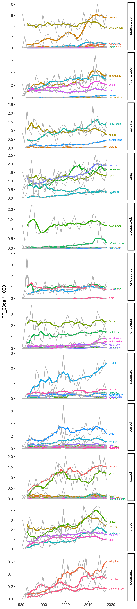

analysis
================

Analyzing n-grams!

``` r
library(tidyverse)
```

    ## ── Attaching packages ─────────────────────────────────────── tidyverse 1.3.1 ──

    ## ✓ ggplot2 3.3.5     ✓ purrr   0.3.4
    ## ✓ tibble  3.1.6     ✓ dplyr   1.0.7
    ## ✓ tidyr   1.1.4     ✓ stringr 1.4.0
    ## ✓ readr   2.1.0     ✓ forcats 0.5.1

    ## ── Conflicts ────────────────────────────────────────── tidyverse_conflicts() ──
    ## x dplyr::filter() masks stats::filter()
    ## x dplyr::lag()    masks stats::lag()

``` r
library(tidytext)
library(ggpubr)
library(directlabels)
```

clean data frame

``` r
df <- read_csv("data/output/search-descriptive.csv")
```

    ## New names:
    ## * institution -> institution...51
    ## * institution -> institution...52

    ## Rows: 24669 Columns: 126

    ## ── Column specification ────────────────────────────────────────────────────────
    ## Delimiter: ","
    ## chr   (1): journal
    ## dbl (124): yr, total_words, agroforestry, Agroforestry, NDC, NDCs, IPCC, agr...
    ## lgl   (1): title

    ## 
    ## ℹ Use `spec()` to retrieve the full column specification for this data.
    ## ℹ Specify the column types or set `show_col_types = FALSE` to quiet this message.

``` r
df <- df %>%
  select(-c(title)) %>%
  mutate(ID = 1:nrow(df)) %>%
  mutate(agroforestry = agroforestry + Agroforestry) %>%
  filter(agroforestry>0) %>%
  select(-Agroforestry)

unique(df$journal)
```

    ##  [1] "Area"                                                                                                                                                 
    ##  [2] "Wiley Interdisciplinary Reviews: Climate Change"                                                                                                      
    ##  [3] "The Rangeland Journal"                                                                                                                                
    ##  [4] "Mountain Research and Development"                                                                                                                    
    ##  [5] "Food Science & Nutrition"                                                                                                                             
    ##  [6] "Decentralisation and Spatial Rural Development Planning in Cameroon"                                                                                  
    ##  [7] "Plant Breeding"                                                                                                                                       
    ##  [8] "Africa Research Bulletin: Economic, Financial and Technical Series"                                                                                   
    ##  [9] "Phytochemical Analysis"                                                                                                                               
    ## [10] "Applied and Environmental Soil Science"                                                                                                               
    ## [11] "Land Degradation & Development"                                                                                                                       
    ## [12] "Environment and Development Economics"                                                                                                                
    ## [13] "Functional Ecology"                                                                                                                                   
    ## [14] "Canadian Journal of Soil Science"                                                                                                                     
    ## [15] "Invertebrate Conservation and Agricultural EcosystemsInvertebrate Conservation and Agricultural Ecosystems"                                           
    ## [16] "The International Forestry Review"                                                                                                                    
    ## [17] "Crop and Pasture Science"                                                                                                                             
    ## [18] "Gender, Technology & Development"                                                                                                                     
    ## [19] "The Journal of Agricultural Science"                                                                                                                  
    ## [20] "SOIL Discussions"                                                                                                                                     
    ## [21] "Ecology"                                                                                                                                              
    ## [22] "American Anthropologist"                                                                                                                              
    ## [23] "Sustainable Development"                                                                                                                              
    ## [24] "Biotropica"                                                                                                                                           
    ## [25] "International Social Science Journal"                                                                                                                 
    ## [26] "Agricultural Economics"                                                                                                                               
    ## [27] "Ecological Applications"                                                                                                                              
    ## [28] "Water Environment Research"                                                                                                                           
    ## [29] "Depletion of the Forest Resources in the Philippines"                                                                                                 
    ## [30] "Ecoscience"                                                                                                                                           
    ## [31] "Mathematical Methods in the Applied Sciences"                                                                                                         
    ## [32] "Relationality and Resilience in a Not So Relational World?"                                                                                           
    ## [33] "Journal of Planning Literature"                                                                                                                       
    ## [34] "International Relations"                                                                                                                              
    ## [35] "Journal of Phytopathology"                                                                                                                            
    ## [36] "Flavour and Fragrance Journal"                                                                                                                        
    ## [37] "ISPRS - International Archives of the Photogrammetry, Remote Sensing and Spatial Information Sciences"                                                
    ## [38] "Frontiers in Ecology and the Environment"                                                                                                             
    ## [39] "Journal of Vegetation Science"                                                                                                                        
    ## [40] "Ecosphere"                                                                                                                                            
    ## [41] "Anthropology News"                                                                                                                                    
    ## [42] "Restoration Ecology"                                                                                                                                  
    ## [43] "Soil Carbon DynamicsSoil Carbon Dynamics"                                                                                                             
    ## [44] "American Journal of Primatology"                                                                                                                      
    ## [45] "Environmental Entomology"                                                                                                                             
    ## [46] "Journal of Ethnobiology"                                                                                                                              
    ## [47] "Ecology and Evolution"                                                                                                                                
    ## [48] "Environmental Microbiology Reports"                                                                                                                   
    ## [49] "Environment and Planning E: Nature and Space"                                                                                                         
    ## [50] "Oryx"                                                                                                                                                 
    ## [51] "Insect Molecular Biology"                                                                                                                             
    ## [52] "Experimental Agriculture"                                                                                                                             
    ## [53] "Focus on Geography"                                                                                                                                   
    ## [54] "Forest Pathology"                                                                                                                                     
    ## [55] "Irrigation and Drainage"                                                                                                                              
    ## [56] "Natural Resources Forum"                                                                                                                              
    ## [57] "Applied Vegetation Science"                                                                                                                           
    ## [58] "Culture & Agriculture"                                                                                                                                
    ## [59] "Ecological Research"                                                                                                                                  
    ## [60] "Global Change Biology"                                                                                                                                
    ## [61] "Rethinking Sustainability"                                                                                                                            
    ## [62] "Rangeland Ecology & Management"                                                                                                                       
    ## [63] "Biodiversity Conservation in Costa Rica"                                                                                                              
    ## [64] "Journal of Environment & Development"                                                                                                                 
    ## [65] "Introduction to the Environmental Physics of Soil, Water and Watersheds, AnAn Introduction to the Environmental Physics of Soil, Water and Watersheds"
    ## [66] "Studies in History"                                                                                                                                   
    ## [67] "Natural Hazards and Earth System Sciences"                                                                                                            
    ## [68] "The Auk"                                                                                                                                              
    ## [69] "South African Journal of Science "                                                                                                                    
    ## [70] "Asia Pacific Viewpoint"                                                                                                                               
    ## [71] "Journal of Ecology"                                                                                                                                   
    ## [72] "Proceedings of the National Academy of Sciences of the United States of America"                                                                      
    ## [73] "Ecology and Society"                                                                                                                                  
    ## [74] "Hydrological Processes"                                                                                                                               
    ## [75] "Diversity and Distributions"                                                                                                                          
    ## [76] "Australian Journal of Agricultural and Resource Economics"                                                                                            
    ## [77] "Soils, Land and FoodSoils, Land and Food"                                                                                                             
    ## [78] "Geographical Review"                                                                                                                                  
    ## [79] "Hydrology and Earth System Sciences"                                                                                                                  
    ## [80] "Freshwater Science"

``` r
themes <- read_csv("data/themes.csv") %>%
  rename(name = term)
```

    ## Rows: 73 Columns: 2

    ## ── Column specification ────────────────────────────────────────────────────────
    ## Delimiter: ","
    ## chr (2): theme, term

    ## 
    ## ℹ Use `spec()` to retrieve the full column specification for this data.
    ## ℹ Specify the column types or set `show_col_types = FALSE` to quiet this message.

``` r
# aggregate terms
df_aggregate <- df %>%
  filter(agroforestry>quantile(df$agroforestry,0.25)) %>%
  mutate(agroforestry = agroforestry) %>%
  mutate(IPCC = NDC + NDCs + IPCC,  # 
         agreement = agreements + agreement,
         climate = climate + carbon,
         SDG =  SDGs + SDG, 
         development = development + developed + developing,
          mitigation = mitigation + sequestration,
         adaptation = adaptation) %>%
  mutate(market = market + markets,  
         economy = economy + economies,
         taxes = taxes,
         subsidies = subsidies + subsidy,
         incentives = incentives + incentive,
         policy = policy + policies + political,
         private = private,
         structure = structural) %>%
  mutate(global = global + world + international, #global, state, country, regional, landscape
         state = state + states,
         country = country + countries + national + nation,
         regional = regional + region,
         landscape = landscape + landscapes) %>%
  mutate(government = government + governments, #government, institute, centralized, infrastructure, polycentric
         institute = institute, 
        centralized = centralized,
         infrastructure = infrastructure,
        polycentric = polycentric ) %>%
  mutate(farmer = farmers + farmer,  #farmer, practitioner, smallholder, stakeholder, individual, producers, growers,
          practitioner = practitioner + practitioners, 
          smallholder =  smallholder + smallholders, 
          stakeholder = stakeholder + stakeholders,
          individual =  individual + individuals,
          producers = producers + producer,
          growers = grower + growers,) %>%
  mutate(farm = farm + farms, # farms, household, practice, labor, livelihood
         household = households + household,
         practice = practice + practices, 
         labor = labor,
         livelihood = livelihood) %>%
  mutate(intersectionality = intersectionality, #intersectionality, race, gender, agency, access, sovereignty, justics, colonization, equity,
         race = race,
         gender = women + gender,
         agency = agency,
         access = access + tenure,
         sovereignty = sovereignty,
         justice = justice,
         colonization = colonization,
         equity = equity) %>%
  mutate(community = community + communities + communal, #community, rural, social, network, cooperative, local
         rural = rural,
         social = social,
         network = network,
         cooperative = cooperative,
         local = local) %>%
  mutate(traditional = traditional, #traditional, TEK, Indigenous, native
         TEK = TEK,
        Indigenous = Indigenous +indigenous,
        native = native) %>%
  mutate(culture = culture+cultural+cultures,  #culture, knowledge, perceptions, attitude
        knowledge = knowing + knowledge,
        perceptions = perceptions + perception,
        attitude = attitude) %>%
  mutate(participatory = participatory, #participatory, feminist, interview, postcolonial, survey, model, SES
        feminist = feminism+feminist,
        interview = interview+interviews,
        postcolonial = colonial +postcolonial,
        survey = survey, 
        model = model,
        SES = SES) %>%
  mutate(adoption = adoption, #adoption, transition, transformation
        transition = transition + transitions,
        transformation = transformation) %>%
  select(yr, ID, total_words, agroforestry, 
         IPCC, agreement, climate, SDG, development, mitigation, adaptation,
         market, economy, taxes, subsidies, incentives, policy, private, structure,
         global, state, country, regional, landscape,
         government, institute, centralized, infrastructure, polycentric,
         farmer, practitioner, smallholder, stakeholder, individual, producers, growers,
         farm, household, practice, labor, livelihood,
         intersectionality, race, gender, agency, access, sovereignty, justice, colonization, equity,
         community, rural, social, network, cooperative, local,
         traditional, TEK, Indigenous, native,
         culture, knowledge, perceptions, attitude,
         participatory, feminist, interview, postcolonial, survey, model, SES,
         adoption, transition, transformation) %>%
  pivot_longer(-c(yr, total_words, ID, agroforestry)) %>%
  mutate(TF = value/total_words,
         agroforestry = agroforestry/total_words) %>%
  left_join(themes)
```

    ## Joining, by = "name"

``` r
library(zoo)
```

    ## 
    ## Attaching package: 'zoo'

    ## The following objects are masked from 'package:base':
    ## 
    ##     as.Date, as.Date.numeric

``` r
df_aggregate %>%
  #filter(general == "a") %>%
  group_by(yr, name, theme) %>%
  summarise(count = sum(value),
            total_words = sum(total_words)) %>%
  mutate(TF = count/total_words) %>%
  filter(yr >1980 & yr<2021) %>%
  group_by(name, theme) %>%
  mutate(TF_03da = zoo::rollmean(TF, k = 5, fill = NA)) %>%
  mutate(TF = ifelse(yr>2018,NA,TF)) %>%
  ungroup() %>%
  ggplot(aes(x = yr, y = TF_03da*1000, color = name)) +
  geom_line(lwd = 1.2) + 
  #scale_color_brewer(palette="Dark2") +
  geom_line((aes(x = yr, y = TF*1000, col = "grey", type = name)), color = "grey") +
  theme_classic() +
  theme(legend.position = "none",
        axis.title.x = element_blank()) +
  expand_limits(x = c(1980, 2025)) +
  geom_dl(aes(label = name), method = list(dl.trans(x = x + 0.2), "last.points", cex = 0.5)) + 
  facet_grid(rows = vars(theme), scales = "free") 
```

    ## `summarise()` has grouped output by 'yr', 'name'. You can override using the `.groups` argument.

    ## Warning: Ignoring unknown aesthetics: type

    ## Warning: Removed 280 row(s) containing missing values (geom_path).

    ## Warning: Removed 140 row(s) containing missing values (geom_path).

    ## Warning: Removed 280 rows containing missing values (geom_dl).

<!-- -->
