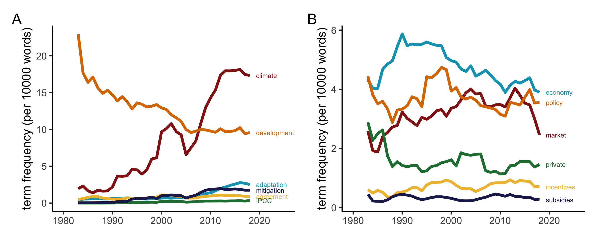
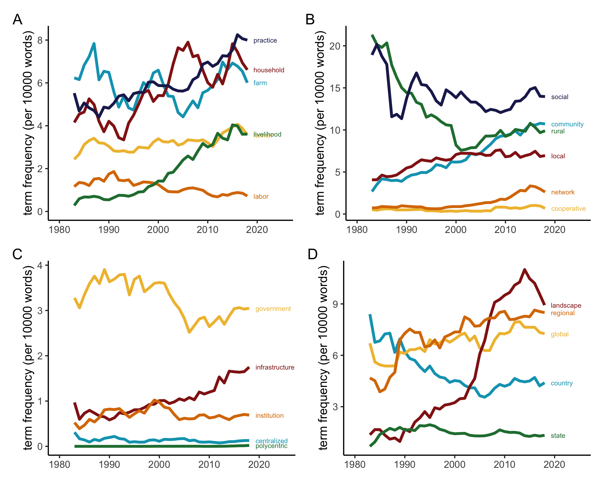
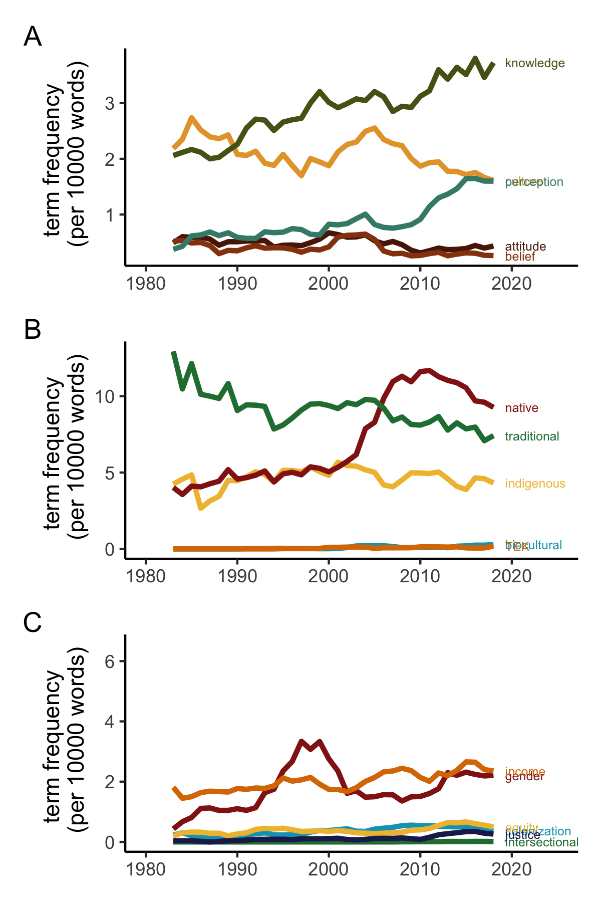

analysis
================

Analyzing n-grams!

``` r
library(tidyverse)
```

    ## ── Attaching packages ─────────────────────────────────────── tidyverse 1.3.1 ──

    ## ✔ ggplot2 3.3.6     ✔ purrr   0.3.4
    ## ✔ tibble  3.1.7     ✔ dplyr   1.0.9
    ## ✔ tidyr   1.2.0     ✔ stringr 1.4.0
    ## ✔ readr   2.1.2     ✔ forcats 0.5.1

    ## ── Conflicts ────────────────────────────────────────── tidyverse_conflicts() ──
    ## ✖ dplyr::filter() masks stats::filter()
    ## ✖ dplyr::lag()    masks stats::lag()

``` r
library(tidytext)
library(ggpubr)
library(directlabels)
library(zoo)
```

    ## 
    ## Attaching package: 'zoo'

    ## The following objects are masked from 'package:base':
    ## 
    ##     as.Date, as.Date.numeric

``` r
library(MetBrewer)
library(patchwork)
```

clean data frame

``` r
df <- read_csv("../data/output/search-descriptive2.csv")
```

    ## New names:
    ## Rows: 24669 Columns: 267
    ## ── Column specification
    ## ──────────────────────────────────────────────────────── Delimiter: "," dbl
    ## (266): yr, total_words, NDC, NDCs, IPCC, agreements, agreement, climate,... lgl
    ## (1): title
    ## ℹ Use `spec()` to retrieve the full column specification for this data. ℹ
    ## Specify the column types or set `show_col_types = FALSE` to quiet this message.
    ## • `state` -> `state...55`
    ## • `state` -> `state...56`
    ## • `regional` -> `regional...62`
    ## • `regional` -> `regional...63`
    ## • `colonial` -> `colonial...148`
    ## • `colonial` -> `colonial...182`
    ## • `intercropping` -> `intercropping...236`
    ## • `intercropping` -> `intercropping...237`

``` r
df <- df %>%
  select(-c(title)) %>%
  mutate(ID = 1:nrow(df)) %>%
  filter(agroforestry>0) 
```

``` r
themes <- read_csv("../data/codebook_new.csv")
```

    ## Rows: 264 Columns: 4
    ## ── Column specification ────────────────────────────────────────────────────────
    ## Delimiter: ","
    ## chr (4): theme, subtheme, terms, subterm
    ## 
    ## ℹ Use `spec()` to retrieve the full column specification for this data.
    ## ℹ Specify the column types or set `show_col_types = FALSE` to quiet this message.

``` r
df_aggregate <- df %>%
  filter(agroforestry>quantile(df$agroforestry,0.25)) %>%
  pivot_longer(-c(yr, total_words)) %>%
  rename(subterm = name) %>%
  left_join(themes) %>%
  group_by(yr, theme, subtheme, terms) %>%
  summarize(total_words = sum(total_words),
            value = sum(value)) %>% ungroup()
```

    ## Joining, by = "subterm"
    ## `summarise()` has grouped output by 'yr', 'theme', 'subtheme'. You can override
    ## using the `.groups` argument.

``` r
a <- df_aggregate %>%
  filter(theme == "Policy and agreements" & subtheme == "Agreement") %>%
  group_by(yr, terms, subtheme, theme) %>%
  summarise(count = sum(value, na.rm = TRUE),
            total_words = sum(total_words, na.rm = TRUE)) %>%
  mutate(TF = count/total_words) %>%
  filter(yr >1980 & yr<2021) %>% #drop_na() %>%
  group_by(terms, subtheme) %>%
  mutate(TF_03da = zoo::rollmean(TF, k = 5, fill = NA)) %>%
  #mutate(TF_03da = replace_na(TF_03da, 0)) %>%
  mutate(TF = ifelse(yr>2018,NA,TF)) %>%
  ungroup() %>% 
  ggplot(aes(x = yr, y = TF_03da*1000, color = terms)) +
  geom_line(lwd = 1.2) + 
  scale_colour_met_d("Degas") +
  #geom_line((aes(x = yr, y = TF*1000, col = "grey", type = terms)), color = "grey") +
  theme_classic() + 
  theme(legend.position = "none",
        axis.title.x = element_blank()) +
  labs(y = "term frequency (per 1000 words)") +
  expand_limits(x = c(1980, 2025)) +
  geom_dl(aes(label = terms), method = list(dl.trans(x = x + 0.2), "last.points", cex = 0.5))
```

    ## `summarise()` has grouped output by 'yr', 'terms', 'subtheme'. You can override
    ## using the `.groups` argument.

``` r
b <- df_aggregate %>%
  filter(theme == "Policy and agreements" & subtheme == "Policy") %>%
  group_by(yr, terms, subtheme, theme) %>%
  summarise(count = sum(value, na.rm = TRUE),
            total_words = sum(total_words, na.rm = TRUE)) %>%
  mutate(TF = count/total_words) %>%
  filter(yr >1980 & yr<2021) %>% #drop_na() %>%
  group_by(terms, subtheme) %>%
  mutate(TF_03da = zoo::rollmean(TF, k = 5, fill = NA)) %>%
  #mutate(TF_03da = replace_na(TF_03da, 0)) %>%
  mutate(TF = ifelse(yr>2018,NA,TF)) %>%
  ungroup() %>% 
  ggplot(aes(x = yr, y = TF_03da*1000, color = terms)) +
  geom_line(lwd = 1.2) + 
  scale_colour_met_d("Degas") +
  #geom_line((aes(x = yr, y = TF*1000, col = "grey", type = terms)), color = "grey") +
  theme_classic() + 
  theme(legend.position = "none",
        axis.title.x = element_blank()) +
  labs(y = "term frequency (per 1000 words)") +
  expand_limits(x = c(1980, 2025)) +
  geom_dl(aes(label = terms), method = list(dl.trans(x = x + 0.2), "last.points", cex = 0.5))# + facet_grid(cols = vars(subtheme))
```

    ## `summarise()` has grouped output by 'yr', 'terms', 'subtheme'. You can override
    ## using the `.groups` argument.

``` r
library(patchwork)
a+b+plot_annotation(tag_levels = 'A')
```

    ## Warning: Removed 28 row(s) containing missing values (geom_path).

    ## Warning: Removed 28 rows containing missing values (geom_dl).

    ## Warning: Removed 28 row(s) containing missing values (geom_path).

    ## Warning: Removed 28 rows containing missing values (geom_dl).

<!-- -->

``` r
df_aggregate %>%
  filter(theme == "Scales and decision making agents")
```

    ## # A tibble: 1,056 × 6
    ##       yr theme                             subtheme  terms     total_words value
    ##    <dbl> <chr>                             <chr>     <chr>           <dbl> <dbl>
    ##  1  1975 Scales and decision making agents Community community        5304     0
    ##  2  1975 Scales and decision making agents Community cooperat…        3536     0
    ##  3  1975 Scales and decision making agents Community local            7072     0
    ##  4  1975 Scales and decision making agents Community network          3536     0
    ##  5  1975 Scales and decision making agents Community rural            1768     0
    ##  6  1975 Scales and decision making agents Community social           1768     1
    ##  7  1975 Scales and decision making agents Community urban            1768     0
    ##  8  1975 Scales and decision making agents Farm      farm             3536     0
    ##  9  1975 Scales and decision making agents Farm      farmer          21216     0
    ## 10  1975 Scales and decision making agents Farm      household        3536     0
    ## # … with 1,046 more rows

``` r
a <- df_aggregate %>%
  filter(theme == "Scales and decision making agents" & subtheme == "Community") %>%
  group_by(yr, terms, subtheme, theme) %>%
  summarise(count = sum(value, na.rm = TRUE),
            total_words = sum(total_words, na.rm = TRUE)) %>%
  mutate(TF = count/total_words) %>%
  filter(yr >1980 & yr<2021) %>% #drop_na() %>%
  group_by(terms, subtheme) %>%
  mutate(TF_03da = zoo::rollmean(TF, k = 5, fill = NA)) %>%
  #mutate(TF_03da = replace_na(TF_03da, 0)) %>%
  mutate(TF = ifelse(yr>2018,NA,TF)) %>%
  ungroup() %>% 
  ggplot(aes(x = yr, y = TF_03da*1000, color = terms)) +
  geom_line(lwd = 1.2) + 
  scale_colour_met_d("Degas") +
  #geom_line((aes(x = yr, y = TF*1000, col = "grey", type = terms)), color = "grey") +
  theme_classic() + 
  theme(legend.position = "none",
        axis.title.x = element_blank()) +
  labs(y = "term frequency (per 1000 words)") +
  expand_limits(x = c(1980, 2025)) +
  geom_dl(aes(label = terms), method = list(dl.trans(x = x + 0.2), "last.points", cex = 0.5))
```

    ## `summarise()` has grouped output by 'yr', 'terms', 'subtheme'. You can override
    ## using the `.groups` argument.

``` r
b <- df_aggregate %>%
  filter(theme == "Scales and decision making agents" & subtheme == "Farm") %>%
  group_by(yr, terms, subtheme, theme) %>%
  summarise(count = sum(value, na.rm = TRUE),
            total_words = sum(total_words, na.rm = TRUE)) %>%
  mutate(TF = count/total_words) %>%
  filter(yr >1980 & yr<2021) %>% #drop_na() %>%
  group_by(terms, subtheme) %>%
  mutate(TF_03da = zoo::rollmean(TF, k = 5, fill = NA)) %>%
  #mutate(TF_03da = replace_na(TF_03da, 0)) %>%
  mutate(TF = ifelse(yr>2018,NA,TF)) %>%
  ungroup() %>% 
  ggplot(aes(x = yr, y = TF_03da*1000, color = terms)) +
  geom_line(lwd = 1.2) + 
  scale_colour_met_d("Degas") +
  #geom_line((aes(x = yr, y = TF*1000, col = "grey", type = terms)), color = "grey") +
  theme_classic() + 
  theme(legend.position = "none",
        axis.title.x = element_blank()) +
  labs(y = "term frequency (per 1000 words)") +
  expand_limits(x = c(1980, 2025)) +
  geom_dl(aes(label = terms), method = list(dl.trans(x = x + 0.2), "last.points", cex = 0.5))# + facet_grid(cols = vars(subtheme))
```

    ## `summarise()` has grouped output by 'yr', 'terms', 'subtheme'. You can override
    ## using the `.groups` argument.

``` r
c <- df_aggregate %>%
  filter(theme == "Scales and decision making agents" & subtheme == "Government") %>%
  group_by(yr, terms, subtheme, theme) %>%
  summarise(count = sum(value, na.rm = TRUE),
            total_words = sum(total_words, na.rm = TRUE)) %>%
  mutate(TF = count/total_words) %>%
  filter(yr >1980 & yr<2021) %>% #drop_na() %>%
  group_by(terms, subtheme) %>%
  mutate(TF_03da = zoo::rollmean(TF, k = 5, fill = NA)) %>%
  #mutate(TF_03da = replace_na(TF_03da, 0)) %>%
  mutate(TF = ifelse(yr>2018,NA,TF)) %>%
  ungroup() %>% 
  ggplot(aes(x = yr, y = TF_03da*1000, color = terms)) +
  geom_line(lwd = 1.2) + 
  scale_colour_met_d("Degas") +
  #geom_line((aes(x = yr, y = TF*1000, col = "grey", type = terms)), color = "grey") +
  theme_classic() + 
  theme(legend.position = "none",
        axis.title.x = element_blank()) +
  labs(y = "term frequency (per 1000 words)") +
  expand_limits(x = c(1980, 2025)) +
  geom_dl(aes(label = terms), method = list(dl.trans(x = x + 0.2), "last.points", cex = 0.5))
```

    ## `summarise()` has grouped output by 'yr', 'terms', 'subtheme'. You can override
    ## using the `.groups` argument.

``` r
d <- df_aggregate %>%
  filter(theme == "Scales and decision making agents" & subtheme == "Scale") %>%
  group_by(yr, terms, subtheme, theme) %>%
  summarise(count = sum(value, na.rm = TRUE),
            total_words = sum(total_words, na.rm = TRUE)) %>%
  mutate(TF = count/total_words) %>%
  filter(yr >1980 & yr<2021) %>% #drop_na() %>%
  group_by(terms, subtheme) %>%
  mutate(TF_03da = zoo::rollmean(TF, k = 5, fill = NA)) %>%
  #mutate(TF_03da = replace_na(TF_03da, 0)) %>%
  mutate(TF = ifelse(yr>2018,NA,TF)) %>%
  ungroup() %>% 
  ggplot(aes(x = yr, y = TF_03da*1000, color = terms)) +
  geom_line(lwd = 1.2) + 
  scale_colour_met_d("Degas") +
  #geom_line((aes(x = yr, y = TF*1000, col = "grey", type = terms)), color = "grey") +
  theme_classic() + 
  theme(legend.position = "none",
        axis.title.x = element_blank()) +
  labs(y = "term frequency (per 1000 words)") +
  expand_limits(x = c(1980, 2025)) +
  geom_dl(aes(label = terms), method = list(dl.trans(x = x + 0.2), "last.points", cex = 0.5))
```

    ## `summarise()` has grouped output by 'yr', 'terms', 'subtheme'. You can override
    ## using the `.groups` argument.

``` r
library(patchwork)
(c+a)/(b+d) + plot_annotation(tag_levels = 'A')
```

    ## Warning: Removed 20 row(s) containing missing values (geom_path).

    ## Warning: Removed 20 rows containing missing values (geom_dl).

    ## Warning: Removed 28 row(s) containing missing values (geom_path).

    ## Warning: Removed 28 rows containing missing values (geom_dl).

    ## Warning: Removed 28 row(s) containing missing values (geom_path).

    ## Warning: Removed 28 rows containing missing values (geom_dl).

    ## Warning: Removed 20 row(s) containing missing values (geom_path).

    ## Warning: Removed 20 rows containing missing values (geom_dl).

<!-- -->

``` r
a <- df_aggregate %>%
  filter(theme == "Culture, knowledge, and equity" & subtheme == "Culture and Perceptions") %>%
  group_by(yr, terms, subtheme, theme) %>%
  summarise(count = sum(value, na.rm = TRUE),
            total_words = sum(total_words, na.rm = TRUE)) %>%
  mutate(TF = count/total_words) %>%
  filter(yr >1980 & yr<2021) %>% #drop_na() %>%
  group_by(terms, subtheme) %>%
  mutate(TF_03da = zoo::rollmean(TF, k = 5, fill = NA)) %>%
  #mutate(TF_03da = replace_na(TF_03da, 0)) %>%
  mutate(TF = ifelse(yr>2018,NA,TF)) %>%
  ungroup() %>% 
  ggplot(aes(x = yr, y = TF_03da*1000, color = terms)) +
  geom_line(lwd = 1.2) + 
  scale_colour_met_d("Degas") +
  #geom_line((aes(x = yr, y = TF*1000, col = "grey", type = terms)), color = "grey") +
  theme_classic() + 
  theme(legend.position = "none",
        axis.title.x = element_blank()) +
  labs(y = "term frequency (per 1000 words)") +
  expand_limits(x = c(1980, 2025)) +
  geom_dl(aes(label = terms), method = list(dl.trans(x = x + 0.2), "last.points", cex = 0.5))
```

    ## `summarise()` has grouped output by 'yr', 'terms', 'subtheme'. You can override
    ## using the `.groups` argument.

``` r
b <- df_aggregate %>%
  filter(theme == "Culture, knowledge, and equity" & subtheme == "Indigenous") %>%
  group_by(yr, terms, subtheme, theme) %>%
  summarise(count = sum(value, na.rm = TRUE),
            total_words = sum(total_words, na.rm = TRUE)) %>%
  mutate(TF = count/total_words) %>%
  filter(yr >1980 & yr<2021) %>% #drop_na() %>%
  group_by(terms, subtheme) %>%
  mutate(TF_03da = zoo::rollmean(TF, k = 5, fill = NA)) %>%
  #mutate(TF_03da = replace_na(TF_03da, 0)) %>%
  mutate(TF = ifelse(yr>2018,NA,TF)) %>%
  ungroup() %>% 
  ggplot(aes(x = yr, y = TF_03da*1000, color = terms)) +
  geom_line(lwd = 1.2) + 
  scale_colour_met_d("Degas") +
  #geom_line((aes(x = yr, y = TF*1000, col = "grey", type = terms)), color = "grey") +
  theme_classic() + 
  theme(legend.position = "none",
        axis.title.x = element_blank()) +
  labs(y = "term frequency (per 1000 words)") +
  expand_limits(x = c(1980, 2025)) +
  geom_dl(aes(label = terms), method = list(dl.trans(x = x + 0.2), "last.points", cex = 0.5))# + facet_grid(cols = vars(subtheme))
```

    ## `summarise()` has grouped output by 'yr', 'terms', 'subtheme'. You can override
    ## using the `.groups` argument.

``` r
c <- df_aggregate %>%
  filter(theme == "Culture, knowledge, and equity" & subtheme == "Power") %>%
  group_by(yr, terms, subtheme, theme) %>%
  summarise(count = sum(value, na.rm = TRUE),
            total_words = sum(total_words, na.rm = TRUE)) %>%
  mutate(TF = count/total_words) %>%
  filter(yr >1980 & yr<2021) %>% #drop_na() %>%
  group_by(terms, subtheme) %>%
  mutate(TF_03da = zoo::rollmean(TF, k = 5, fill = NA)) %>%
  #mutate(TF_03da = replace_na(TF_03da, 0)) %>%
  mutate(TF = ifelse(yr>2018,NA,TF)) %>%
  ungroup() %>% 
  ggplot(aes(x = yr, y = TF_03da*1000, color = terms)) +
  geom_line(lwd = 1.2) + 
  scale_colour_met_d("Degas") +
  #geom_line((aes(x = yr, y = TF*1000, col = "grey", type = terms)), color = "grey") +
  theme_classic() + 
  theme(legend.position = "none",
        axis.title.x = element_blank()) +
  labs(y = "term frequency (per 1000 words)") +
  expand_limits(x = c(1980, 2025)) +
  geom_dl(aes(label = terms), method = list(dl.trans(x = x + 0.2), "last.points", cex = 0.5))
```

    ## `summarise()` has grouped output by 'yr', 'terms', 'subtheme'. You can override
    ## using the `.groups` argument.

``` r
library(patchwork)
(a+b+c) + plot_annotation(tag_levels = 'A') + plot_layout(nrow = 2, ncol = 2,  byrow = FALSE)
```

    ## Warning: Removed 20 row(s) containing missing values (geom_path).

    ## Warning: Removed 20 rows containing missing values (geom_dl).

    ## Warning: Removed 20 row(s) containing missing values (geom_path).

    ## Warning: Removed 20 rows containing missing values (geom_dl).

    ## Warning: Removed 188 row(s) containing missing values (geom_path).

    ## Warning: Removed 44 rows containing missing values (geom_dl).

<!-- -->

``` r
a <- df_aggregate %>%
  filter(theme == "Approaches and perspectives" & subtheme == "Perspectives") %>%
  group_by(yr, terms, subtheme, theme) %>%
  summarise(count = sum(value, na.rm = TRUE),
            total_words = sum(total_words, na.rm = TRUE)) %>%
  mutate(TF = count/total_words) %>%
  filter(yr >1980 & yr<2021) %>% #drop_na() %>%
  group_by(terms, subtheme) %>%
  mutate(TF_03da = zoo::rollmean(TF, k = 5, fill = NA)) %>%
  #mutate(TF_03da = replace_na(TF_03da, 0)) %>%
  mutate(TF = ifelse(yr>2018,NA,TF)) %>%
  ungroup() %>% 
  ggplot(aes(x = yr, y = TF_03da*1000, color = terms)) +
  geom_line(lwd = 1.2) + 
  scale_colour_met_d("Degas") +
  #geom_line((aes(x = yr, y = TF*1000, col = "grey", type = terms)), color = "grey") +
  theme_classic() + 
  theme(legend.position = "none",
        axis.title.x = element_blank()) +
  labs(y = "term frequency (per 1000 words)") +
  expand_limits(x = c(1980, 2025)) +
  geom_dl(aes(label = terms), method = list(dl.trans(x = x + 0.2), "last.points", cex = 0.5))
```

    ## `summarise()` has grouped output by 'yr', 'terms', 'subtheme'. You can override
    ## using the `.groups` argument.

``` r
b <- df_aggregate %>%
  filter(theme == "Approaches and perspectives" & subtheme == "Framework") %>%
  group_by(yr, terms, subtheme, theme) %>%
  summarise(count = sum(value, na.rm = TRUE),
            total_words = sum(total_words, na.rm = TRUE)) %>%
  mutate(TF = count/total_words) %>%
  filter(yr >1980 & yr<2021) %>% #drop_na() %>%
  group_by(terms, subtheme) %>%
  mutate(TF_03da = zoo::rollmean(TF, k = 5, fill = NA)) %>%
  #mutate(TF_03da = replace_na(TF_03da, 0)) %>%
  mutate(TF = ifelse(yr>2018,NA,TF)) %>%
  ungroup() %>% 
  ggplot(aes(x = yr, y = TF_03da*1000, color = terms)) +
  geom_line(lwd = 1.2) + 
  scale_colour_met_d("Degas") +
  #geom_line((aes(x = yr, y = TF*1000, col = "grey", type = terms)), color = "grey") +
  theme_classic() + 
  theme(legend.position = "none",
        axis.title.x = element_blank()) +
  labs(y = "term frequency (per 1000 words)") +
  expand_limits(x = c(1980, 2025)) +
  geom_dl(aes(label = terms), method = list(dl.trans(x = x + 0.2), "last.points", cex = 0.5))# + facet_grid(cols = vars(subtheme))
```

    ## `summarise()` has grouped output by 'yr', 'terms', 'subtheme'. You can override
    ## using the `.groups` argument.

``` r
c <- df_aggregate %>%
  filter(theme == "Approaches and perspectives" & subtheme == "Methods") %>%
  group_by(yr, terms, subtheme, theme) %>%
  summarise(count = sum(value, na.rm = TRUE),
            total_words = sum(total_words, na.rm = TRUE)) %>%
  mutate(TF = count/total_words) %>%
  filter(yr >1980 & yr<2021) %>% #drop_na() %>%
  group_by(terms, subtheme) %>%
  mutate(TF_03da = zoo::rollmean(TF, k = 5, fill = NA)) %>%
  #mutate(TF_03da = replace_na(TF_03da, 0)) %>%
  mutate(TF = ifelse(yr>2018,NA,TF)) %>%
  ungroup() %>% 
  ggplot(aes(x = yr, y = TF_03da*1000, color = terms)) +
  geom_line(lwd = 1.2) + 
  scale_colour_met_d("Degas") +
  #geom_line((aes(x = yr, y = TF*1000, col = "grey", type = terms)), color = "grey") +
  theme_classic() + 
  theme(legend.position = "none",
        axis.title.x = element_blank()) +
  labs(y = "term frequency (per 1000 words)") +
  expand_limits(x = c(1980, 2025)) +
  geom_dl(aes(label = terms), method = list(dl.trans(x = x + 0.2), "last.points", cex = 0.5))
```

    ## `summarise()` has grouped output by 'yr', 'terms', 'subtheme'. You can override
    ## using the `.groups` argument.

``` r
library(patchwork)
(a+b+c) + plot_annotation(tag_levels = 'A')+  plot_layout(ncol = 2, byrow = FALSE)
```

    ## Warning: Removed 12 row(s) containing missing values (geom_path).

    ## Warning: Removed 12 rows containing missing values (geom_dl).

    ## Warning: Removed 12 row(s) containing missing values (geom_path).

    ## Warning: Removed 12 rows containing missing values (geom_dl).

    ## Warning: Removed 28 row(s) containing missing values (geom_path).

    ## Warning: Removed 28 rows containing missing values (geom_dl).

<!-- -->

# reports

clean data frame

``` r
df <- read_csv("../data/output/search-descriptive-reports2.csv")
```

    ## New names:
    ## Rows: 647 Columns: 267
    ## ── Column specification
    ## ──────────────────────────────────────────────────────── Delimiter: "," dbl
    ## (266): yr, total_words, NDC, NDCs, IPCC, agreements, agreement, climate,... lgl
    ## (1): title
    ## ℹ Use `spec()` to retrieve the full column specification for this data. ℹ
    ## Specify the column types or set `show_col_types = FALSE` to quiet this message.
    ## • `state` -> `state...55`
    ## • `state` -> `state...56`
    ## • `regional` -> `regional...62`
    ## • `regional` -> `regional...63`
    ## • `colonial` -> `colonial...148`
    ## • `colonial` -> `colonial...182`
    ## • `intercropping` -> `intercropping...236`
    ## • `intercropping` -> `intercropping...237`

``` r
df <- df %>%
  select(-c(title)) %>%
  mutate(ID = 1:nrow(df)) %>%
  filter(agroforestry>0)

df_aggregate_reports <- df %>%
  filter(agroforestry>quantile(df$agroforestry,0.25)) %>%
  pivot_longer(-c(yr, total_words)) %>%
  rename(subterm = name) %>%
  left_join(themes) %>%
  group_by(yr, theme, subtheme, terms) %>%
  summarize(total_words = sum(total_words),
            value = sum(value)) %>% ungroup()
```

    ## Joining, by = "subterm"
    ## `summarise()` has grouped output by 'yr', 'theme', 'subtheme'. You can override
    ## using the `.groups` argument.

``` r
df_aggregate_f4 <- df_aggregate %>%
  group_by(yr, terms, theme) %>%
  summarise(count = sum(value),
            total_words = sum(total_words)) %>%
  mutate(TF_academic = count/total_words*1000) %>%
  select(yr, terms, theme, TF_academic) %>%
  filter(yr >1980 & yr<2021)
```

    ## `summarise()` has grouped output by 'yr', 'terms'. You can override using the
    ## `.groups` argument.

``` r
a <- df_aggregate_reports %>%
  group_by(yr, terms, theme) %>%
  summarise(count = sum(value),
            total_words = sum(total_words)) %>%
  mutate(TF_reports = count/total_words*1000) %>%
  filter(yr >1980 & yr<2021) %>% select(yr, terms, theme, TF_reports) %>%
  left_join(df_aggregate_f4) %>% 
  mutate_all(~replace(., . == 0, NA)) %>%
  mutate(rel_frequency = (TF_reports-TF_academic)/TF_reports) %>%
  group_by(terms, theme) %>% 
  summarise(rel_frequency = mean(rel_frequency, na.rm = TRUE)) %>% 
  drop_na() 
```

    ## `summarise()` has grouped output by 'yr', 'terms'. You can override using the
    ## `.groups` argument.
    ## Joining, by = c("yr", "terms", "theme")
    ## `mutate_all()` ignored the following grouping variables:
    ## `summarise()` has grouped output by 'terms'. You can override using the
    ## `.groups` argument.

``` r
b <- df_aggregate_reports %>%
  group_by(yr, terms, theme) %>%
  summarise(count = sum(value),
            total_words = sum(total_words)) %>%
  mutate(TF_reports = count/total_words*1000) %>%
  filter(yr >1980 & yr<2021) %>% select(yr, terms, theme, TF_reports) %>%
  left_join(df_aggregate_f4) %>% 
  filter(yr >2010) %>%
  mutate_all(~replace(., . == 0, NA)) %>%
  mutate(rel_frequency = (TF_reports-TF_academic)/TF_reports) %>%
  group_by(terms, theme) %>% 
  summarise(rel_frequency_2010 = mean(rel_frequency, na.rm = TRUE)) %>% 
  drop_na()
```

    ## `summarise()` has grouped output by 'yr', 'terms'. You can override using the
    ## `.groups` argument.
    ## Joining, by = c("yr", "terms", "theme")
    ## `mutate_all()` ignored the following grouping variables:
    ## `summarise()` has grouped output by 'terms'. You can override using the
    ## `.groups` argument.

``` r
a %>% left_join(b) %>% 
  select(-theme) %>% drop_na() %>%
  pivot_longer(!terms, names_to = "date", values_to = "rel_frequency") %>%
  mutate(color = 
           ifelse(date == "rel_frequency_2010" & rel_frequency >0, "a",
                  ifelse(date == "rel_frequency_2010" & rel_frequency <=0, "b",
                     ifelse(date != "rel_frequency_2010" & rel_frequency >0, "c","d")))) %>%
  ggplot(aes(x=reorder(terms,rel_frequency) , y = rel_frequency, fill = color)) + geom_col(position = "dodge", width = 0.7) +
  theme_classic() + theme(legend.position = "bottom", legend.title = element_blank(), legend.text = element_text(size = 7))+      
  scale_fill_manual(values = c("lightblue", "pink", "darkblue", "darkred")) + 
  geom_hline(yintercept = 0, linetype = "dashed") +
  labs(y = "relative term frequency") +
  coord_flip()  + theme(axis.title.y = element_blank())
```

    ## Joining, by = c("terms", "theme")

<!-- -->

clean data frame

``` r
df <- read_csv("../data/output/search-descriptive-reports2.csv")
```

    ## New names:
    ## Rows: 647 Columns: 267
    ## ── Column specification
    ## ──────────────────────────────────────────────────────── Delimiter: "," dbl
    ## (266): yr, total_words, NDC, NDCs, IPCC, agreements, agreement, climate,... lgl
    ## (1): title
    ## ℹ Use `spec()` to retrieve the full column specification for this data. ℹ
    ## Specify the column types or set `show_col_types = FALSE` to quiet this message.
    ## • `state` -> `state...55`
    ## • `state` -> `state...56`
    ## • `regional` -> `regional...62`
    ## • `regional` -> `regional...63`
    ## • `colonial` -> `colonial...148`
    ## • `colonial` -> `colonial...182`
    ## • `intercropping` -> `intercropping...236`
    ## • `intercropping` -> `intercropping...237`

``` r
df <- df %>%
  select(-c(title)) %>%
  mutate(ID = 1:nrow(df)) %>%
  filter(agroforestry>0)

df_aggregate_reports <- df %>%
  filter(agroforestry>quantile(df$agroforestry,0.25)) %>%
  pivot_longer(-c(yr, total_words)) %>%
  rename(subterm = name) %>%
  left_join(themes) %>%
  group_by(yr, theme) %>%
  summarize(total_words = sum(total_words),
            value = sum(value)) %>% ungroup()
```

    ## Joining, by = "subterm"
    ## `summarise()` has grouped output by 'yr'. You can override using the `.groups`
    ## argument.

``` r
df_aggregate_f4 <- df_aggregate %>%
  group_by(yr, theme) %>%
  summarise(count = sum(value),
            total_words = sum(total_words)) %>%
  mutate(TF_academic = count/total_words*1000) %>%
  select(yr, theme, TF_academic) %>%
  filter(yr >1980 & yr<2021)
```

    ## `summarise()` has grouped output by 'yr'. You can override using the `.groups`
    ## argument.

``` r
a <- df_aggregate_reports %>%
  group_by(yr, theme) %>%
  summarise(count = sum(value),
            total_words = sum(total_words)) %>%
  mutate(TF_reports = count/total_words*1000) %>%
  filter(yr >1980 & yr<2021) %>% select(yr, theme, TF_reports) %>%
  left_join(df_aggregate_f4) %>% 
  mutate_all(~replace(., . == 0, NA)) %>%
  mutate(rel_frequency = (TF_reports-TF_academic)/TF_reports) %>%
  group_by(theme) %>% 
  summarise(rel_frequency = mean(rel_frequency, na.rm = TRUE)) %>% 
  drop_na() 
```

    ## `summarise()` has grouped output by 'yr'. You can override using the `.groups`
    ## argument.
    ## Joining, by = c("yr", "theme")
    ## `mutate_all()` ignored the following grouping variables:

``` r
b <- df_aggregate_reports %>%
  group_by(yr, theme) %>%
  summarise(count = sum(value),
            total_words = sum(total_words)) %>%
  mutate(TF_reports = count/total_words*1000) %>%
  filter(yr >1980 & yr<2021) %>% select(yr,  theme, TF_reports) %>%
  left_join(df_aggregate_f4) %>% 
  filter(yr >2010) %>%
  mutate_all(~replace(., . == 0, NA)) %>%
  mutate(rel_frequency = (TF_reports-TF_academic)/TF_reports) %>%
  group_by(theme) %>% 
  summarise(rel_frequency_2010 = mean(rel_frequency, na.rm = TRUE)) %>% 
  drop_na()
```

    ## `summarise()` has grouped output by 'yr'. You can override using the `.groups`
    ## argument.
    ## Joining, by = c("yr", "theme")
    ## `mutate_all()` ignored the following grouping variables:

``` r
a %>% left_join(b) %>% drop_na() %>%
  pivot_longer(!theme, names_to = "date", values_to = "rel_frequency") %>%
  mutate(color = 
           ifelse(date == "rel_frequency_2010" & rel_frequency >0, "More common in reports (2010 onwards)",
                  ifelse(date == "rel_frequency_2010" & rel_frequency <=0, "More common in academic (2010 onwards)",
                     ifelse(date != "rel_frequency_2010" & rel_frequency >0, "More common in reports overall","More common in academic")))) %>%
  ggplot(aes(x=reorder(theme,rel_frequency) , y = rel_frequency, fill = color)) + geom_col(position = "dodge", width = 0.7) +
  theme_classic() + theme(legend.position = "none", legend.title = element_blank(), legend.text = element_text(size = 7))+      
  #scale_fill_manual(values = c("#a2d9ce ","#0e6251",  "#78281f", "#f1948a")) + 
  geom_hline(yintercept = 0, linetype = "dashed") +
  labs(y = "relative term frequency") +
  coord_flip()  + theme(axis.title.y = element_blank())
```

    ## Joining, by = "theme"

<!-- -->
