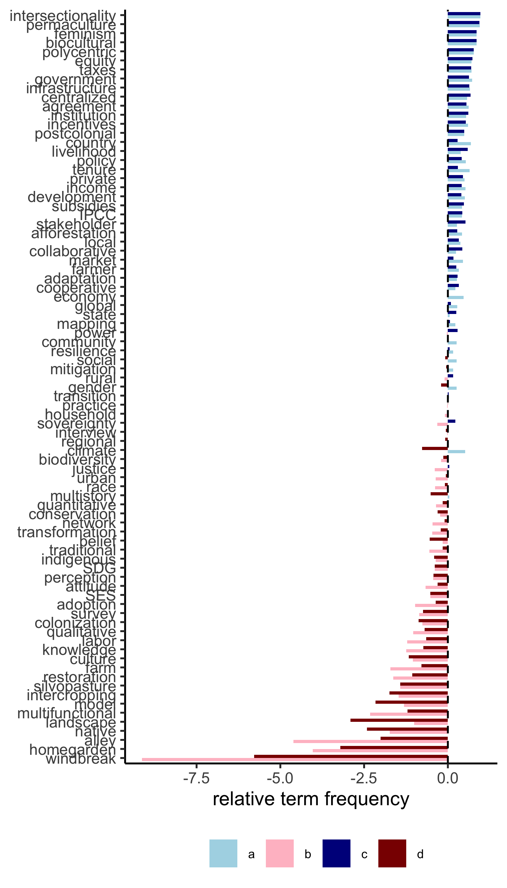

analysis
================

Analyzing n-grams!

``` r
library(tidyverse)
```

    ## ── Attaching packages ─────────────────────────────────────── tidyverse 1.3.1 ──

    ## ✓ ggplot2 3.3.5     ✓ purrr   0.3.4
    ## ✓ tibble  3.1.6     ✓ dplyr   1.0.7
    ## ✓ tidyr   1.1.4     ✓ stringr 1.4.0
    ## ✓ readr   2.1.1     ✓ forcats 0.5.1

    ## ── Conflicts ────────────────────────────────────────── tidyverse_conflicts() ──
    ## x dplyr::filter() masks stats::filter()
    ## x dplyr::lag()    masks stats::lag()

``` r
library(tidytext)
library(ggpubr)
library(directlabels)
library(zoo)
```

    ## 
    ## Attaching package: 'zoo'

    ## The following objects are masked from 'package:base':
    ## 
    ##     as.Date, as.Date.numeric

``` r
library(MetBrewer)
library(patchwork)
```

clean data frame

``` r
df <- read_csv("../data/output/search-descriptive.csv")
```

    ## New names:
    ## * institution -> institution...51
    ## * institution -> institution...52

    ## Rows: 24669 Columns: 126

    ## ── Column specification ────────────────────────────────────────────────────────
    ## Delimiter: ","
    ## chr   (1): journal
    ## dbl (124): yr, total_words, agroforestry, Agroforestry, NDC, NDCs, IPCC, agr...
    ## lgl   (1): title

    ## 
    ## ℹ Use `spec()` to retrieve the full column specification for this data.
    ## ℹ Specify the column types or set `show_col_types = FALSE` to quiet this message.

``` r
df <- df %>%
  select(-c(title)) %>%
  mutate(ID = 1:nrow(df)) %>%
  mutate(agroforestry = agroforestry + Agroforestry) %>%
  filter(agroforestry>0) %>%
  select(-Agroforestry)
```

``` r
themes <- read_csv("../data/themes.csv") %>%
  rename(name = term)
```

    ## Rows: 72 Columns: 3

    ## ── Column specification ────────────────────────────────────────────────────────
    ## Delimiter: ","
    ## chr (3): theme, term, general

    ## 
    ## ℹ Use `spec()` to retrieve the full column specification for this data.
    ## ℹ Specify the column types or set `show_col_types = FALSE` to quiet this message.

``` r
# aggregate terms
df_aggregate <- df %>%
  filter(agroforestry>quantile(df$agroforestry,0.25)) %>%
  mutate(agroforestry = agroforestry) %>%
  mutate(IPCC = NDC + NDCs + IPCC,  # 
         agreement = agreements + agreement,
         climate = climate + carbon,
         SDG =  SDGs + SDG, 
         development = development + developed + developing,
         mitigation = mitigation + sequestration,
         adaptation = adaptation) %>%
  mutate(market = market + markets,  
         economy = economy + economies,
         taxes = taxes,
         subsidies = subsidies + subsidy,
         incentives = incentives + incentive,
         policy = policy + policies + political,
         private = private,
         structure = structural) %>%
  mutate(global = global + world + international, #global, state, country, regional, landscape
         state = state + states,
         country = country + countries + national + nation,
         regional = regional + region,
         landscape = landscape + landscapes) %>%
  mutate(government = government + governments, #government, institute, centralized, infrastructure, polycentric
         institute = institute, 
        centralized = centralized,
         infrastructure = infrastructure,
        polycentric = polycentric ) %>%
  mutate(farmer = farmers + farmer,  #farmer, practitioner, smallholder, stakeholder, individual, producers, growers,
          practitioner = practitioner + practitioners, 
          smallholder =  smallholder + smallholders, 
          stakeholder = stakeholder + stakeholders,
          individual =  individual + individuals,
          producers = producers + producer,
          growers = grower + growers,) %>%
  mutate(farm = farm + farms, # farms, household, practice, labor, livelihood
         household = households + household,
         practice = practice + practices, 
         labor = labor,
         livelihood = livelihood) %>%
  mutate(intersectionality = intersectionality, #intersectionality, race, gender, agency, access, sovereignty, justics, colonization, equity,
         race = race,
         gender = women + gender,
         agency = agency,
         access = access + tenure,
         sovereignty = sovereignty,
         justice = justice,
         colonization = colonization,
         equity = equity) %>%
  mutate(community = community + communities + communal, #community, rural, social, network, cooperative, local
         rural = rural,
         social = social,
         network = network,
         cooperative = cooperative,
         local = local) %>%
  mutate(traditional = traditional, #traditional, TEK, Indigenous, native
         TEK = TEK,
        Indigenous = Indigenous +indigenous,
        native = native) %>%
  mutate(culture = culture+cultural+cultures,  #culture, knowledge, perceptions, attitude
        knowledge = knowing + knowledge,
        perceptions = perceptions + perception,
        attitude = attitude) %>%
  mutate(participatory = participatory, #participatory, feminist, interview, postcolonial, survey, model, SES
        feminist = feminism+feminist,
        interview = interview+interviews,
        postcolonial = colonial +postcolonial,
        survey = survey, 
        model = model,
        SES = SES) %>%
  mutate(adoption = adoption, #adoption, transition, transformation
        transition = transition + transitions,
        transformation = transformation) %>%
  select(yr, ID, total_words, agroforestry, 
         climate, SDG, development, mitigation, adaptation,
         market, economy, taxes, subsidies, incentives, policy, private, structure,
         global, state, country, regional, landscape,
         government, institute, infrastructure, polycentric,
         farmer, practitioner, smallholder, stakeholder, individual, producers, growers,
         farm, household, practice, labor, livelihood,
         intersectionality, race, gender, agency, access, sovereignty, justice, colonization, equity,
         community, rural, social, network, cooperative, local,
         traditional, TEK, Indigenous, native,
         culture, knowledge, perceptions, attitude,
         participatory, feminist, interview, postcolonial, survey, model, SES,
         adoption, transition, transformation) %>%
  pivot_longer(-c(yr, total_words, ID, agroforestry)) %>%
  mutate(TF = value/total_words,
         agroforestry = agroforestry/total_words) %>%
  left_join(themes)
```

    ## Joining, by = "name"

``` r
a <- df_aggregate %>%
  filter(theme == "agreement") %>%
  group_by(yr, name, theme) %>%
  summarise(count = sum(value),
            total_words = sum(total_words)) %>%
  mutate(TF = count/total_words) %>%
  filter(yr >1980 & yr<2021) %>% drop_na() %>%
  group_by(name, theme) %>%
  mutate(TF_03da = zoo::rollmean(TF, k = 5, fill = NA)) %>%
  mutate(TF = ifelse(yr>2018,NA,TF)) %>%
  ungroup() %>%
  ggplot(aes(x = yr, y = TF_03da*1000, color = name)) +
  geom_line(lwd = 1.2) + 
  scale_colour_met_d("Degas") +
  #geom_line((aes(x = yr, y = TF*1000, col = "grey", type = name)), color = "grey") +
  theme_classic() + 
  theme(legend.position = "none",
        axis.title.x = element_blank()) +
  labs(y = "term frequency (per 1000 words)") +
  expand_limits(x = c(1980, 2025)) +
  geom_dl(aes(label = name), method = list(dl.trans(x = x + 0.2), "last.points", cex = 0.5))
```

    ## `summarise()` has grouped output by 'yr', 'name'. You can override using the `.groups` argument.

``` r
b <- df_aggregate %>%
  filter(theme == "agreement") %>%
    mutate(TF = TF*1000) %>%
  select(ID, name, TF) %>% pivot_wider(names_from = name, values_from = TF) %>% ggplot(aes(x = log(climate), y = log(development))) + geom_point(alpha = 0.5) +
    scale_colour_met_d("Degas") + theme_classic()

c<- df_aggregate %>%
  filter(theme == "agreement") %>%
    mutate(TF = TF*1000) %>%
  select(ID, name, TF) %>% pivot_wider(names_from = name, values_from = TF) %>% ggplot(aes(x = log(climate), y = log(adaptation))) + geom_point(alpha = 0.5) +
    scale_colour_met_d("Degas") + theme_classic()

d <- df_aggregate %>%
  filter(theme == "agreement") %>%
    mutate(TF = TF*1000) %>%
  select(ID, name, TF) %>% pivot_wider(names_from = name, values_from = TF) %>% ggplot(aes(x = log(climate), y = log(mitigation))) + geom_point(alpha = 0.5) +
    scale_colour_met_d("Degas") + theme_classic()

e <- df_aggregate %>%
  filter(theme == "agreement") %>%
  select(ID, name, TF) %>%
  mutate(TF = TF*1000) %>%
  pivot_wider(names_from = name, values_from = TF) %>% ggplot(aes(x = log(mitigation), y = log(adaptation))) + geom_point(alpha = 0.5) + theme_classic()

f <- (b+c)/(d+e)+plot_annotation(tag_levels = c("A", "B", "C", "D")) 
a +f + plot_annotation(tag_levels = c("A", "B", "C", "D")) 
```

    ## Warning: Removed 16 row(s) containing missing values (geom_path).

    ## Warning: Removed 16 rows containing missing values (geom_dl).

<!-- -->

``` r
a <- df_aggregate %>%
  filter(theme == c("scale")) %>%
  group_by(yr, name, theme) %>%
  summarise(count = sum(value),
            total_words = sum(total_words)) %>%
  mutate(TF = count/total_words) %>%
  filter(yr >1980 & yr<2021) %>% drop_na() %>%
  group_by(name, theme) %>%
  mutate(TF_03da = zoo::rollmean(TF, k = 5, fill = NA)) %>%
  mutate(TF = ifelse(yr>2018,NA,TF)) %>%
  ungroup() %>%
  ggplot(aes(x = yr, y = TF_03da*1000, color = name)) +
  geom_line(lwd = 1.2) + 
  scale_colour_met_d("Degas") +
  #geom_line((aes(x = yr, y = TF*1000, col = "grey", type = name)), color = "grey") +
  theme_classic() + 
  theme(legend.position = "none",
        axis.title.x = element_blank()) +
  labs(y = "term frequency (per 1000 words)") +
  expand_limits(x = c(1980, 2025)) +
  geom_dl(aes(label = name), method = list(dl.trans(x = x + 0.2), "last.points", cex = 0.5))
```

    ## `summarise()` has grouped output by 'yr', 'name'. You can override using the `.groups` argument.

``` r
b <- df_aggregate %>%
  filter(theme == c("government", "individual")) %>%
  group_by(yr, name, theme) %>%
  summarise(count = sum(value),
            total_words = sum(total_words)) %>%
  mutate(TF = count/total_words) %>%
  filter(yr >1980 & yr<2021) %>% drop_na() %>%
  group_by(name, theme) %>%
  mutate(TF_03da = zoo::rollmean(TF, k = 5, fill = NA)) %>%
  mutate(TF = ifelse(yr>2018,NA,TF)) %>%
  ungroup() %>%
  ggplot(aes(x = yr, y = TF_03da*1000, color = name)) +
  geom_line(lwd = 1.2) + 
  scale_colour_met_d("Degas") +
  #geom_line((aes(x = yr, y = TF*1000, col = "grey", type = name)), color = "grey") +
  theme_classic() + 
  theme(legend.position = "none",
        axis.title.x = element_blank()) +
  labs(y = "term frequency (per 1000 words)") +
  expand_limits(x = c(1980, 2025)) +
  geom_dl(aes(label = name), method = list(dl.trans(x = x + 0.2), "last.points", cex = 0.5))
```

    ## `summarise()` has grouped output by 'yr', 'name'. You can override using the `.groups` argument.

``` r
a+b + plot_annotation(tag_levels = 'A')
```

    ## Warning: Removed 20 row(s) containing missing values (geom_path).

    ## Warning: Removed 20 rows containing missing values (geom_dl).

    ## Warning: Removed 20 row(s) containing missing values (geom_path).

    ## Warning: Removed 20 rows containing missing values (geom_dl).

<!-- -->

``` r
a <- df_aggregate %>%
  filter(theme == c("power")) %>%
  group_by(yr, name, theme) %>%
  summarise(count = sum(value),
            total_words = sum(total_words)) %>%
  mutate(TF = count/total_words) %>%
  filter(yr >1980 & yr<2021) %>% drop_na() %>%
  group_by(name, theme) %>%
  mutate(TF_03da = zoo::rollmean(TF, k = 5, fill = NA)) %>%
  mutate(TF = ifelse(yr>2018,NA,TF)) %>%
  ungroup() %>%
  ggplot(aes(x = yr, y = TF_03da*1000, color = name)) +
  geom_line(lwd = 1.2) + 
  scale_colour_met_d("Degas") +
  #geom_line((aes(x = yr, y = TF*1000, col = "grey", type = name)), color = "grey") +
  theme_classic() + 
  theme(legend.position = "none",
        axis.title.x = element_blank()) +
  labs(y = "term frequency (per 1000 words)") +
  expand_limits(x = c(1980, 2025)) +
  geom_dl(aes(label = name), method = list(dl.trans(x = x + 0.2), "last.points", cex = 0.5))
```

    ## `summarise()` has grouped output by 'yr', 'name'. You can override using the `.groups` argument.

``` r
b <- df_aggregate %>%
  filter(theme == c("methods")) %>%
  group_by(yr, name, theme) %>%
  summarise(count = sum(value),
            total_words = sum(total_words)) %>%
  mutate(TF = count/total_words) %>%
  filter(yr >1980 & yr<2021) %>% drop_na() %>%
  group_by(name, theme) %>%
  mutate(TF_03da = zoo::rollmean(TF, k = 5, fill = NA)) %>%
  mutate(TF = ifelse(yr>2018,NA,TF)) %>%
  ungroup() %>%
  ggplot(aes(x = yr, y = TF_03da*1000, color = name)) +
  geom_line(lwd = 1.2) + 
  scale_colour_met_d("Degas") +
  #geom_line((aes(x = yr, y = TF*1000, col = "grey", type = name)), color = "grey") +
  theme_classic() + 
  theme(legend.position = "none",
        axis.title.x = element_blank()) +
  labs(y = "term frequency (per 1000 words)") +
  expand_limits(x = c(1980, 2025)) +
  geom_dl(aes(label = name), method = list(dl.trans(x = x + 0.2), "last.points", cex = 0.5))
```

    ## `summarise()` has grouped output by 'yr', 'name'. You can override using the `.groups` argument.

``` r
a+b + plot_annotation(tag_levels = 'A')
```

    ## Warning: Removed 108 row(s) containing missing values (geom_path).

    ## Warning: Removed 36 rows containing missing values (geom_dl).

    ## Warning: Removed 28 row(s) containing missing values (geom_path).

    ## Warning: Removed 28 rows containing missing values (geom_dl).

<!-- --> # reports

clean data frame

``` r
df <- read_csv("../data/output/search-descriptive-reports.csv")
```

    ## New names:
    ## * institution -> institution...51
    ## * institution -> institution...52

    ## Rows: 650 Columns: 125

    ## ── Column specification ────────────────────────────────────────────────────────
    ## Delimiter: ","
    ## dbl (124): yr, total_words, agroforestry, Agroforestry, NDC, NDCs, IPCC, agr...
    ## lgl   (1): title

    ## 
    ## ℹ Use `spec()` to retrieve the full column specification for this data.
    ## ℹ Specify the column types or set `show_col_types = FALSE` to quiet this message.

``` r
df <- df %>%
  select(-c(title)) %>%
  mutate(ID = 1:nrow(df)) %>%
  mutate(agroforestry = agroforestry + Agroforestry) %>%
  filter(agroforestry>0) %>%
  select(-Agroforestry)

# aggregate terms
df_aggregate_reports <- df %>%
  filter(agroforestry>quantile(df$agroforestry,0.25)) %>%
  mutate(agroforestry = agroforestry) %>%
  mutate(IPCC = NDC + NDCs + IPCC,  # 
         agreement = agreements + agreement,
         climate = climate + carbon,
         SDG =  SDGs + SDG, 
         development = development + developed + developing,
          mitigation = mitigation + sequestration,
         adaptation = adaptation) %>%
  mutate(market = market + markets,  
         economy = economy + economies,
         taxes = taxes,
         subsidies = subsidies + subsidy,
         incentives = incentives + incentive,
         policy = policy + policies + political,
         private = private,
         structure = structural) %>%
  mutate(global = global + world + international, #global, state, country, regional, landscape
         state = state + states,
         country = country + countries + national + nation,
         regional = regional + region,
         landscape = landscape + landscapes) %>%
  mutate(government = government + governments, #government, institute, centralized, infrastructure, polycentric
         institute = institute, 
        centralized = centralized,
         infrastructure = infrastructure,
        polycentric = polycentric ) %>%
  mutate(farmer = farmers + farmer,  #farmer, practitioner, smallholder, stakeholder, individual, producers, growers,
          practitioner = practitioner + practitioners, 
          smallholder =  smallholder + smallholders, 
          stakeholder = stakeholder + stakeholders,
          individual =  individual + individuals,
          producers = producers + producer,
          growers = grower + growers,) %>%
  mutate(farm = farm + farms, # farms, household, practice, labor, livelihood
         household = households + household,
         practice = practice + practices, 
         labor = labor,
         livelihood = livelihood) %>%
  mutate(intersectionality = intersectionality, #intersectionality, race, gender, agency, access, sovereignty, justics, colonization, equity,
         race = race,
         gender = women + gender,
         agency = agency,
         access = access + tenure,
         sovereignty = sovereignty,
         justice = justice,
         colonization = colonization,
         equity = equity) %>%
  mutate(community = community + communities + communal, #community, rural, social, network, cooperative, local
         rural = rural,
         social = social,
         network = network,
         cooperative = cooperative,
         local = local) %>%
  mutate(traditional = traditional, #traditional, TEK, Indigenous, native
         TEK = TEK,
        Indigenous = Indigenous +indigenous,
        native = native) %>%
  mutate(culture = culture+cultural+cultures,  #culture, knowledge, perceptions, attitude
        knowledge = knowing + knowledge,
        perceptions = perceptions + perception,
        attitude = attitude) %>%
  mutate(participatory = participatory, #participatory, feminist, interview, postcolonial, survey, model, SES
        feminist = feminism+feminist,
        interview = interview+interviews,
        postcolonial = colonial +postcolonial,
        survey = survey, 
        model = model,
        SES = SES) %>%
  mutate(adoption = adoption, #adoption, transition, transformation
        transition = transition + transitions,
        transformation = transformation) %>%
  select(yr, ID, total_words, agroforestry, 
         #IPCC, agreement, 
         climate, #SDG, development, 
         mitigation, adaptation,
         #market, economy, #taxes, subsidies, incentives, 
         policy,# private, structure,
         global, state, country, regional,# landscape,
         #government,# institute, #centralized, infrastructure, polycentric,
         farmer, #practitioner, smallholder, stakeholder, individual, producers, growers,
         farm, household, #practice, 
         labor, livelihood,
         intersectionality, race, gender, agency, access, #sovereignty, justice, colonization,
         equity,
         community, rural, social, #network, cooperative, #local,
         #traditional, TEK, Indigenous, native,
         culture, knowledge, perceptions, attitude,
         participatory, feminist, interview, postcolonial, survey, model, SES,
         #adoption, transition 
         #transformation
         ) %>%
  pivot_longer(-c(yr, total_words, ID, agroforestry)) %>%
  mutate(TF = value/total_words,
         agroforestry = agroforestry/total_words) %>%
  left_join(themes)
```

    ## Joining, by = "name"

``` r
df_aggregate_f4 <- df_aggregate %>%
  group_by(yr, name, theme) %>%
  summarise(count = sum(value),
            total_words = sum(total_words)) %>%
  mutate(TF_academic = count/total_words*1000) %>%
  select(yr, name, theme, TF_academic) %>%
  filter(yr >1980 & yr<2021)
```

    ## `summarise()` has grouped output by 'yr', 'name'. You can override using the `.groups` argument.

``` r
a <- df_aggregate_reports %>%
  group_by(yr, name, theme) %>%
  summarise(count = sum(value),
            total_words = sum(total_words)) %>%
  mutate(TF_reports = count/total_words*1000) %>%
  filter(yr >1980 & yr<2021) %>% select(yr, name, theme, TF_reports) %>%
  left_join(df_aggregate_f4) %>% 
  mutate_all(~replace(., . == 0, NA)) %>%
  mutate(rel_frequency = (TF_reports-TF_academic)/TF_reports) %>%
  group_by(name, theme) %>% 
  summarise(rel_frequency = mean(rel_frequency, na.rm = TRUE)) %>% 
  drop_na() %>%
  ggplot(aes(x=reorder(name,rel_frequency) , y = rel_frequency, fill = theme)) + geom_col() +
  theme_classic() + theme(legend.position = "bottom", legend.title = element_blank(), legend.text = element_text(size = 7))+      
  scale_fill_met_d("Cross") + geom_hline(yintercept = 0, linetype = "dashed") +
  labs(y = "relative term frequency") +
  coord_flip()  + theme(axis.title.y = element_blank())
```

    ## `summarise()` has grouped output by 'yr', 'name'. You can override using the `.groups` argument.

    ## Joining, by = c("yr", "name", "theme")

    ## `mutate_all()` ignored the following grouping variables:
    ## Columns `yr`, `name`
    ## Use `mutate_at(df, vars(-group_cols()), myoperation)` to silence the message.

    ## `summarise()` has grouped output by 'name'. You can override using the `.groups` argument.

``` r
b <- df_aggregate_reports %>%
  group_by(yr, name, theme) %>%
  summarise(count = sum(value),
            total_words = sum(total_words)) %>%
  mutate(TF_reports = count/total_words*1000) %>%
  filter(yr >1980 & yr<2021) %>% select(yr, name, theme, TF_reports) %>%
  left_join(df_aggregate_f4) %>% 
  filter(yr >2010) %>%
  mutate_all(~replace(., . == 0, NA)) %>%
  mutate(rel_frequency = (TF_reports-TF_academic)/TF_reports) %>%
  group_by(name, theme) %>% 
  summarise(rel_frequency = mean(rel_frequency, na.rm = TRUE)) %>% 
  drop_na() %>%
  ggplot(aes(x=reorder(name,rel_frequency) , y = rel_frequency, fill = theme)) + geom_col() +
  theme_classic() + theme(legend.position = "bottom", legend.title = element_blank(), legend.text = element_text(size = 7))+      
  scale_fill_met_d("Cross") + geom_hline(yintercept = 0, linetype = "dashed") +
  labs(y = "relative term frequency") +
  coord_flip()  + theme(axis.title.y = element_blank())
```

    ## `summarise()` has grouped output by 'yr', 'name'. You can override using the `.groups` argument.

    ## Joining, by = c("yr", "name", "theme")

    ## `mutate_all()` ignored the following grouping variables:
    ## Columns `yr`, `name`
    ## Use `mutate_at(df, vars(-group_cols()), myoperation)` to silence the message.

    ## `summarise()` has grouped output by 'name'. You can override using the `.groups` argument.

``` r
a+ b + plot_annotation(tag_levels = 'A') &
  theme(legend.position = "bottom") 
```

<!-- -->
